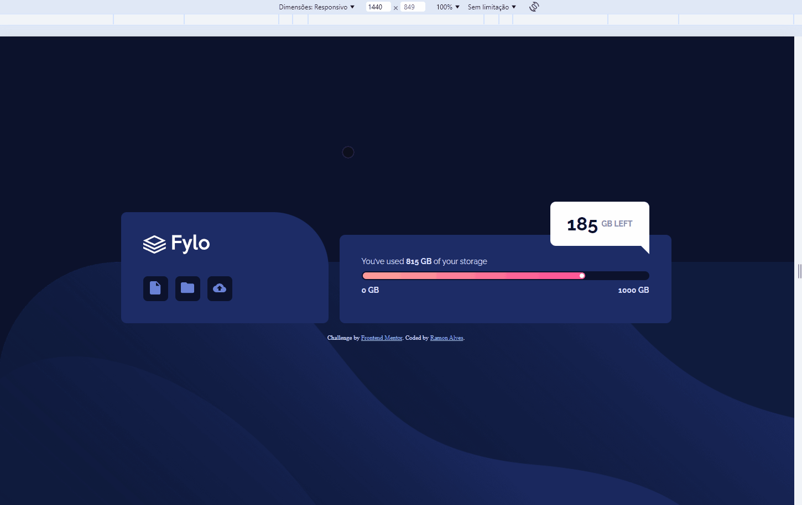

# Frontend Mentor - Fylo data storage component solution

This is a solution to the [Fylo data storage component challenge on Frontend Mentor](https://www.frontendmentor.io/challenges/fylo-data-storage-component-1dZPRbV5n). Frontend Mentor challenges help you improve your coding skills by building realistic projects. 

## Table of contents

## Overview

### The challenge 🏆

Users should be able to:

- View the optimal layout for the site depending on their device's screen size

## Screenshot 🎴

- ### Responsivity

### Links 

- Solution URL: [Frontend Mentor](https://www.frontendmentor.io/solutions/-html5-e-css-18-3-junior-fylo-data-storage-fWMYcFZTwM)
- Live Site URL: [Live Site preview](https://ramon-alvez.github.io/Frontend-Mentor-HTML-CSS-Junior-Fylo-Data-Storage-/)

## My process 💻✒

### Built with 🧱🛠

- Semantic HTML5 markup
- CSS custom properties
- Flexbox
- Mobile-first workflow

### What I learned 📚

I learned that sometimes it's easier to start thinking about the mobile structure first and then go to the desktop

### Continued development 🚀

My current goal is to finish all the FrontEnd Mentor challenges, to train and learn in the process. After finishing all HTML and CSS challenges, I will start JavaScript lessons.

## Author 🧙‍♂️

- GitHub - [Ramon Alvez](https://github.com/Ramon-Alvez)
- Frontend Mentor - [@Ramon Alvez](https://www.frontendmentor.io/profile/Ramon-Alvez)
- LinkedIn - [@Ramon Alvez](https://www.linkedin.com/in/ramon-alvez/)
